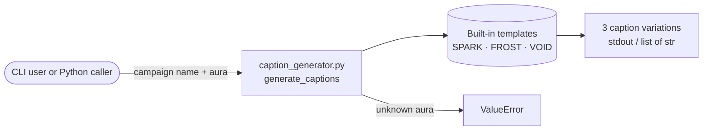

# syndical-lab-

**Template-based marketing caption generator (SYNDICORE experiments)**


A small Python CLI and module that turns a **campaign name** and an **aura** into three ready-to-post marketing captions. Each aura has its own tone: `SPARK` is energetic, `FROST` is minimal and precise, and `VOID` is mysterious. Captions come from built-in templates in `caption_generator.py`. There are no API calls and no dependencies beyond the Python standard library, even though `.env.example` hints at future LLM support. It's a lab piece of the SYNDICORE tooling, meant for quickly drafting campaign copy or for reuse via `generate_captions()`.

## Architecture



## Stack

- Python 3 (standard library only)

## Project structure

```text
caption_generator.py   templates, generate_captions() and the CLI entry point
.env.example           placeholder settings (not read by the current code)
Dockerfile             container draft (see note below)
```

## Local development

No install step is needed. Run the script directly:

```bash
python caption_generator.py "Neon Drop" SPARK
```

Or use it from Python:

```python
from caption_generator import generate_captions
generate_captions("Neon Drop", "void")  # aura is case-insensitive
```

## Environment variables

Listed in `.env.example`, but `caption_generator.py` doesn't read any of them yet:

- `OPENAI_API_KEY`
- `ANTHROPIC_API_KEY`
- `OUTPUT_DIR`

## Deploy

There's no deploy target. The `Dockerfile` is a draft and won't build as committed: it expects `pyproject.toml`, `poetry.lock` and a `main.py` that aren't in the repo. Use the script directly until those exist.

## Related

Part of the SYNDICORE tooling alongside [syndical-core-](https://github.com/FriskyDevelopments/syndical-core-), which has its own campaign API with the same aura concept. Merging the two into one tool is still under consideration.
